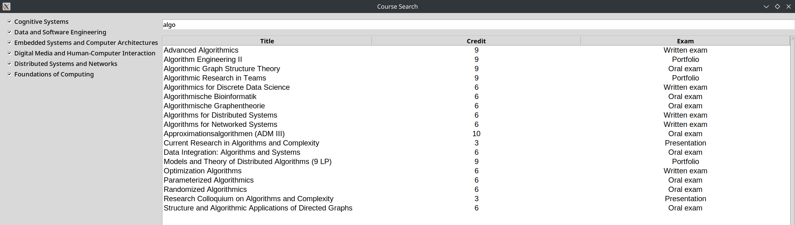

# TU Berlin CS Course Search
TU Berlin Course Search for Computer Science (Informatik) (M. Sc.) - StuPO 2015 as of Wi/Se 2024/5

# How to use
run `python app.py`. 

# Functions
- Search for course title with the textbox.
- Press enter to search.
- Clicking on a row copies the course title.  
- Clicking on each column heading sorts by that column.
- Select fields with each checkbox.

# If you want to generate the data yourself for a different degree program or in the future
1. Get the module list pdf in Moses and create text files under the folder`fields` for each field by copy and pasting tables from the pdf.
2. run `python generate.py`
3. run `python app.py` to run the app.
